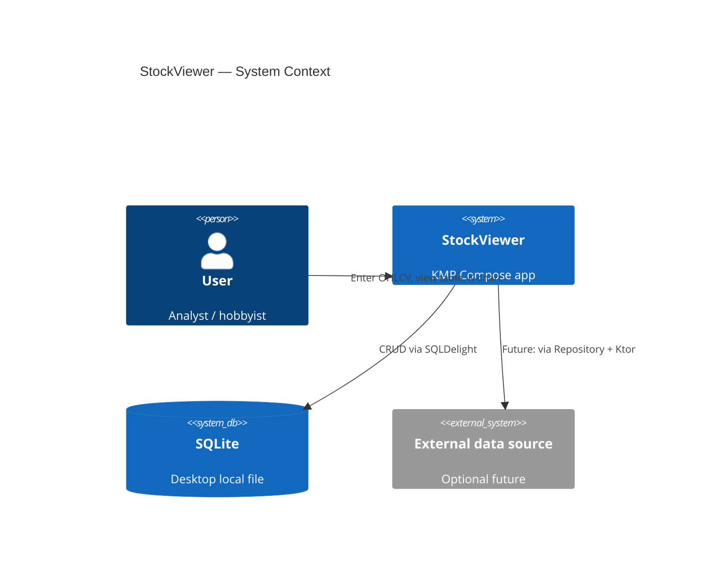

# StockViewer — System Architecture

> **Architecture source of truth (SSOT)** for humans and AI agents.  
> Implementation contracts and agent workflow: see [`AGENTS.md`](./AGENTS.md).  
> Decision history: see [`docs/adr/`](./docs/adr/).  
> Package dependency rules: see [`docs/modules/boundaries.md`](./docs/modules/boundaries.md).

**Last reviewed:** 2026-07-12 (docs-only architecture wave)

---

## 1. Overview

### 1.1 Purpose

StockViewer is a **desktop-first** Kotlin Multiplatform application for storing and visualizing **daily OHLCV** bars related to SpaceX valuation / secondary-market style data (not a public listed ticker).

Users can:

1. **Manually enter** a single daily bar (upsert by date).
2. **Browse** recent rows in a table dialog.
3. **View** a candlestick + volume chart for the recent window.

### 1.2 Platforms

| Platform | Role | Persistence |
|----------|------|-------------|
| **Desktop (JVM)** | Primary product surface | SQLDelight + SQLite file `~/.stockviewer/spacex.db` |
| **WasmJS** | Secondary / experimental | Phase 1: driver **stub** (fails fast on DB open) |

See [ADR 0005](./docs/adr/0005-desktop-primary-wasm-secondary.md).

### 1.3 Non-goals (current architecture)

- Public exchange market-data integration as the primary source of truth.
- Multi-user backend, accounts, or cloud sync (unless introduced later behind Repository).
- Native charting SDKs that break KMP `commonMain`.
- Full feature parity on Wasm before an explicit Phase 2 decision.

### 1.4 Shape of the system

- **Single Gradle module:** `:composeApp`
- **Logical layering by package** (not multi-module compile boundaries)
- **Repository pattern** over SQLDelight
- **Compose Multiplatform** UI shared in `commonMain`

---

## 2. Context



**Runtime entry (Desktop):** `Main.kt` → `App()` → `SystemSettings.initOnce()` → `StockViewer()`.

---

## 3. Logical modules (packages)

```
composeApp/src/
├── commonMain/kotlin/com/neojou/stockviewer/
│   ├── App.kt, StockViewer.kt          # shell
│   ├── domain/                         # pure Kotlin
│   ├── data/                           # SQLDelight adapters
│   ├── presentation/                   # Compose UI
│   ├── di/                             # AppContainer
│   ├── platform/                       # expect DB driver
│   ├── network/                        # expect HttpClient (unused by features)
│   └── …/tools/                        # MyLog, SystemSettings
│       ├── ui/menu/                    # MyTopMenuBar, MyTopMenuItem (shared Compose UI)
│       └── database/                   # MyDb, MyCrudTable, SQLite open (shared)
├── commonMain/sqldelight/…/DailyOhlcv.sq
├── desktopMain/…                       # actual DB + Ktor CIO
└── wasmJsMain/…                        # actual DB stub + Ktor Js
```

```mermaid
flowchart TB
  subgraph Presentation
    Shell[StockViewer shell]
    TB[MyTopMenuBar]
    Input[OhlcvInputDialog]
    View[OhlcvDataTableDialog]
    Chart[CandlestickChart]
  end
  subgraph Domain
    Model[DailyOhlcv]
    Val[OhlcvValidator]
    RepoI[OhlcvRepository]
  end
  subgraph Data
    RepoImpl[OhlcvRepositoryImpl]
    Mapper[OhlcvMapper]
    SQL[(SQLDelight / SQLite)]
  end
  subgraph Platform
    Driver[DatabaseDriverFactory]
  end
  DI[AppContainer]

  Shell --> TB
  Shell --> Input & View & Chart
  Shell --> DI
  DI --> RepoImpl
  DI --> Driver
  Input --> Val & RepoI
  View --> RepoI
  Chart --> RepoI
  RepoI <|..| RepoImpl
  RepoImpl --> Mapper --> Model
  RepoImpl --> SQL
  Driver --> SQL
```

Dependency rules (enforced by convention today): [`docs/modules/boundaries.md`](./docs/modules/boundaries.md).

---

## 4. Layer responsibilities

| Layer | Package root | Responsibility | Must not |
|-------|--------------|----------------|----------|
| **Domain** | `…domain` | Entities, validation, repository **interfaces** | Compose, SQLDelight, `java.*` |
| **Data** | `…data` | SQLDelight queries, mapping, repository **impl** | Compose UI |
| **Presentation** | `…presentation` | Compose screens, dialogs, Canvas chart | Import generated `…database` SQLDelight types |
| **DI** | `…di` | Wire implementations (AppContainer) | UI rendering |
| **Platform** | `…platform` | `SqlDriver` factory expect/actual | Business rules |
| **Network** | `…network` | Ktor `HttpClient` factory expect/actual | Currently unused by features |
| **Tools** | `…tools` | Logging, process init, shared menu UI, **MyDb** | Domain rules; no product schema |
| **Shell** | `App`, `StockViewer` | Bootstrap, navigation orchestration | SQL details |

---

## 5. Component catalog

| Component | Location | Responsibility |
|-----------|----------|----------------|
| `App` | shell | Theme, one-shot `SystemSettings`, host `StockViewer` |
| `StockViewer` | shell | Toolbar callbacks, repository acquire, dialog flags, `MainContent` |
| `MyTopMenuBar` / `MyTopMenuItem` | `com.neojou.tools.ui.menu` | Configurable top menu (no product labels); host supplies items |
| StockViewer menu assembly | `StockViewer.kt` | Product menu tree (Database / K Chart) as `List<MyTopMenuItem>` |
| `OhlcvInputDialog` | presentation/form | Form fields, validate, `upsert` |
| `OhlcvDataTableDialog` | presentation/list | `getRecent(100)`, six-column table |
| `CandlestickChart` | presentation/chart | Viewport candles + volume + nav (`<+->`) + crosshair; **currently** observes repository internally |
| `ChartLayout` / viewport | presentation/chart | Geometry, ticks, colors, `ChartViewport` pan/zoom (no I/O) |
| `OhlcvValidator` | domain/validation | Parse/validate OHLC rules |
| `OhlcvRepository` | domain/repository | Persistence contract (`Flow` + suspend `Result`) |
| `OhlcvRepositoryImpl` | data/repository | SQLDelight-backed impl |
| `AppContainer` | di | Lazy singleton repository via `openStockViewerData()` |
| `MyDb` / `MyDbConfig` / `openMyDb` | `com.neojou.tools.database` | Portable SQLite open (Desktop path / Wasm stub) |
| `MyCrudTable` | `com.neojou.tools.database` | Optional generic table CRUD contract |
| `MyCrudRepository` | `com.neojou.tools.database` | Open class: delegates CRUD/observeAll to [MyCrudTable] |
| `DailyOhlcvTable` | data/table | `MyCrudTable` + OHLCV helpers (`getRecent`, range) |
| `OhlcvRepositoryImpl` | data/repository | Extends `MyCrudRepository`; adds range/recent only |
| `createHttpClient` | network | Platform engines; **no feature consumer yet** |

**Note:** `presentation/list/OhlcvDataViewDialog.kt` exists but is **not** referenced by `StockViewer` (dead / alternate UI). Treat as gap until removed or wired—do not document as primary View path.

---

## 6. Data model

### 6.1 Domain

```text
DailyOhlcv(
  date: LocalDate,   // identity
  open, high, low, close: Double,
  volume: Long
)
```

- **Identity:** trading `date` (one row per day).
- **Write semantics:** `upsert` → SQL `INSERT OR REPLACE` (same date overwrites).
- **Validation:** application-level via `OhlcvValidator` (not only DB constraints).

### 6.2 Persistence

- Database name: `StockViewerDatabase`
- Table: `daily_ohlcv` (see `.sq` under `commonMain/sqldelight`)
- Queries: `selectAll`, `selectByDateRange`, `selectRecent`, `insertOrReplace`, `deleteByDate`
- Desktop path: `{user.home}/.stockviewer/spacex.db` via `MyDbConfig(appName="stockviewer", databaseFileName="spacex.db")`

Migration policy is **not fully productized** (gap): treat schema changes carefully; prefer SQLDelight migrations before shipping breaking changes to existing user DBs.

---

## 7. Data flows

### 7.1 Input (write)

```text
Toolbar Database → Input
  → OhlcvInputDialog (string fields)
  → OhlcvValidator.parseAndValidate()
  → OhlcvRepository.upsert()
  → SQLDelight insertOrReplace → SQLite
  → Snackbar on success
  → If K Chart visible: observeAll emissions refresh chart
```

### 7.2 View (read snapshot)

```text
Toolbar Database → View
  → OhlcvDataTableDialog
  → getRecent(limit=100)
  → ORDER BY date DESC LIMIT 100
  → Table UI (weight columns: Date, O, H, L, C, V)
```

### 7.3 K Chart (read stream + selection)

```text
Toolbar K Chart → MainContent.KChart
  → CandlestickChart(repository)
  → observeAll() → sort by date (full series)
  → ChartViewport: default last min(60, n) bars; pan/zoom via < + - >
  → Y scales recompute from visible window only
  → default selection = rightmost visible bar
  → click → update header + crosshair
       vertical @ day slot (price + volume panes)
       horizontal @ close price (price pane full width)
  → nav bar between price and volume canvases
```

**Architectural intent (evolution, not current code):** chart should accept `List<DailyOhlcv>` (+ selection) so Canvas stays free of I/O. See §10.

---

## 8. Navigation model

```text
MyTopMenuBar(items = …)   // generic UI in tools.ui.menu
└── items built in StockViewer:
    ├── Database
    │   ├── Input  → modal dialog (overlay)
    │   └── View   → modal dialog (overlay)
    └── K Chart    → replaces main content (Home | KChart)
```

Rules:

- `MyTopMenuBar` is **app-agnostic**; it only renders `List<MyTopMenuItem>`.
- Product labels/actions live in the **host** (`StockViewer`); other apps reuse the bar without editing tools.
- Shell owns dialog visibility and `MainContent`.
- Repository readiness: `AppContainer.ohlcvRepository(): Result`; failure → Snackbar (expected on Wasm Phase 1).

---

## 9. Cross-cutting concerns

| Concern | Approach |
|---------|----------|
| Logging | `MyLog` with per-module tags |
| Process init | `SystemSettings.initOnce()` idempotent |
| Errors | `Result` from repository; UI Snackbar / in-dialog messages |
| Async | Coroutines; dialogs use `rememberCoroutineScope`; repo uses background dispatchers |
| DI | Manual `AppContainer` (no Koin/Hilt) |
| Dates | `kotlinx.datetime.LocalDate` only in commonMain |

---

## 10. Known gaps and evolution

| ID | Topic | Current | Direction |
|----|--------|---------|-----------|
| G1 | Chart data binding | Chart holds `OhlcvRepository` and collects Flow | Prefer **list injection** + shell/VM owns subscription ([E2]) |
| G2 | UI state | State in Composables; no shared ViewModel | Optional lightweight UiState/coordinator when edit/delete/CSV land |
| G3 | Wasm persistence | Driver throws | InMemory repository **or** sql.js Phase 2 (product decision) |
| G4 | Dead UI | `OhlcvDataViewDialog` unused | Delete or wire; avoid dual View implementations |
| G5 | Network | Ktor scaffold only | Introduce remote port only behind Repository |
| G6 | Tests | Strategy in AGENTS; little automated coverage | Validator unit + in-memory/repo integration |
| G7 | Schema migration | Ad-hoc | SQLDelight migration story before production upgrades |
| G8 | Compile-time boundaries | Single module | Optional future split or static checks |

Do **not** jump to multi-module Clean Architecture for a single aggregate (`DailyOhlcv`) without a clear team/scale need.

---

## 11. Technical decisions (index)

| Decision | ADR |
|----------|-----|
| Use Architecture Decision Records | [0001](./docs/adr/0001-record-architecture-decisions.md) |
| SQLDelight + local SQLite | [0002](./docs/adr/0002-sqldelight-sqlite-persistence.md) |
| Compose Multiplatform UI | [0003](./docs/adr/0003-compose-multiplatform-ui.md) |
| Repository + package layering | [0004](./docs/adr/0004-repository-package-layering.md) |
| Desktop-primary / Wasm-secondary | [0005](./docs/adr/0005-desktop-primary-wasm-secondary.md) |

---

## 12. Documentation map

| Document | Role |
|----------|------|
| **ARCHITECTURE.md** (this file) | System architecture SSOT |
| **AGENTS.md** | Agent/developer **implementation** guide, conventions, feature contracts |
| **docs/adr/** | Why decisions were made |
| **docs/modules/boundaries.md** | Allowed package dependencies |
| **docs/ai/** | AI role prompts (not runtime architecture) |
| **docs/k_chart.jpg** | Visual reference for chart UX |

When architecture changes, update **this file** and add/amend an **ADR**. Keep AGENTS focused on “how to implement next” without duplicating long architecture narratives.
